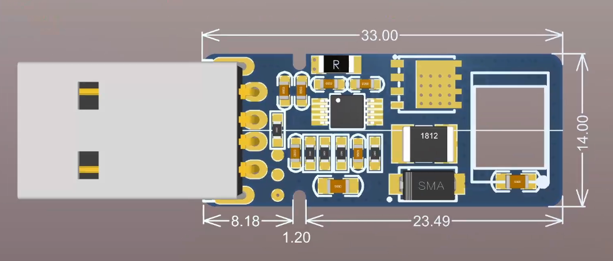
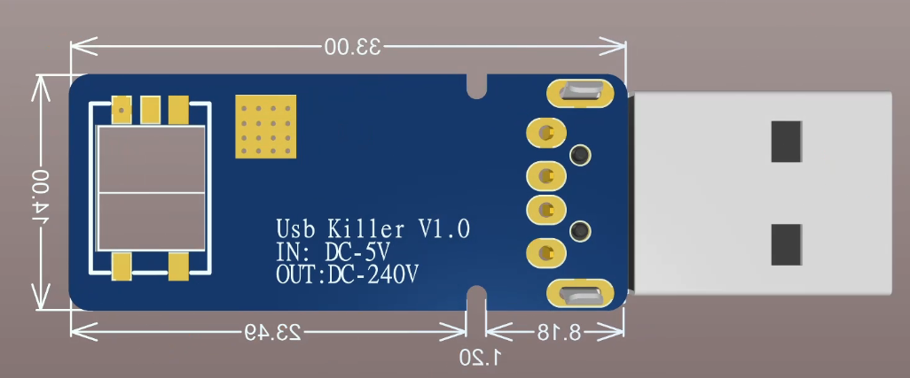

# USB Killer - Hardware Analysis & Documentation

> ⚠️ **EDUCATIONAL PURPOSE ONLY** - This repository contains documentation and analysis of USB Killer devices for educational and research purposes. **DO NOT BUILD OR USE** these devices maliciously.

## 📋 Overview

This repository contains comprehensive documentation and analysis of USB Killer hardware - devices designed to demonstrate USB port vulnerabilities through high-voltage electrical pulses. The content is intended for cybersecurity professionals, hardware engineers, and researchers studying USB security.

### PCB Layout Views

| Front Side | Back Side |
|------------|-----------|
|  |  |
| Component placement and routing | Silkscreen with specifications |

**Device Specifications** (from PCB silkscreen):
- **Model**: USB Killer V1.0
- **Input**: DC-5V (standard USB power)
- **Output**: DC-240V (lethal high voltage)

## 📁 Repository Contents

| File | Description | Type |
|------|-------------|------|
| `UsbKiller.PcbDoc` | Complete PCB design files with component placement | Altium Designer PCB |
| `UsbKiller.PrjPcb` | Project configuration and design rules | Altium Project |
| `UsbKiller.SchDoc` | Schematic diagrams showing circuit topology | Schematic Document |

## 🔧 Technical Specifications

### Circuit Overview
- **Input Voltage**: 5V DC (from USB port)
- **Output Voltage**: 200-400V DC pulses
- **PCB Dimensions**: 33.00mm × 14.00mm
- **Form Factor**: USB-A stick format
- **PCB Layers**: 4-layer design

### Key Features
- Charge pump voltage multiplier circuit  
- High-voltage energy storage capacitors
- Microcontroller-based timing control
- Rapid discharge switching network
- Compact SMD component design

## ⚡ How It Works

1. **Power Harvesting**: Device draws standard 5V from target USB port
2. **Voltage Multiplication**: Charge pump circuit steps voltage up to 200V+
3. **Energy Storage**: High-voltage capacitors accumulate dangerous charge
4. **Controlled Discharge**: Microcontroller triggers rapid release of stored energy
5. **Damage Mechanism**: High-voltage pulse destroys target device circuits

## 🛠️ Opening the Files

### Requirements
- **Altium Designer** (recommended version 20+)
- **KiCad** (alternative, may require conversion)
- **PDF Viewer** (for exported documentation)

## 📊 Component Analysis

| Component Type | Quantity | Function |
|----------------|----------|----------|
| Microcontroller | 1 | Timing and control logic |
| HV Capacitors | 6-8 | Energy storage (200V+) |
| Schottky Diodes | 8-12 | Charge pump rectification |
| MOSFETs | 4-6 | High-speed switching |
| Inductors | 2-3 | Voltage step-up |
| Resistors | 15+ | Current limiting, timing |

